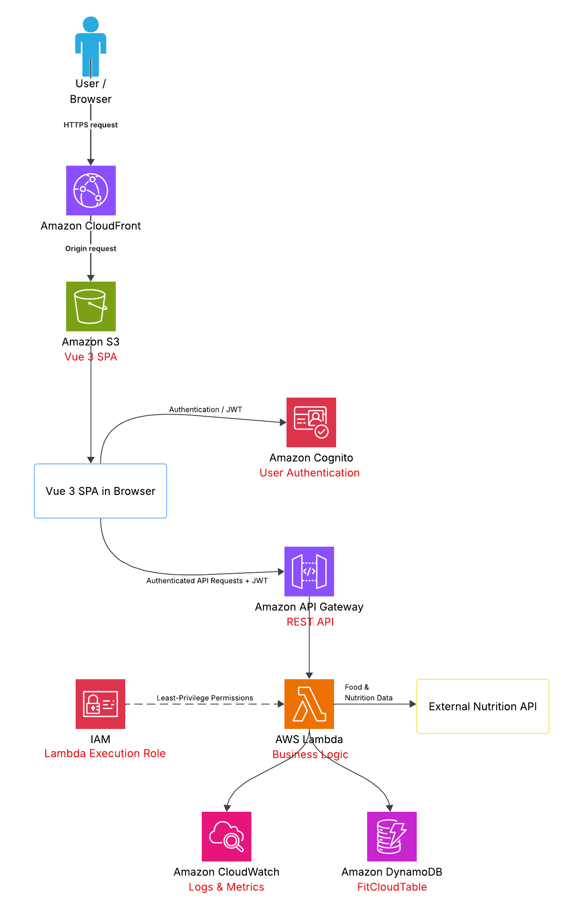

# FitCloud

FitCloud is a serverless fitness tracking and nutrition management web application built on AWS.

## Planned Features

- User registration and authentication
- Workout tracking
- Exercise history and progress tracking
- Daily food logging
- Nutrition analysis, including calories and protein intake

## Architecture

FitCloud uses a serverless AWS architecture with services including Amazon S3, CloudFront, Cognito, API Gateway, AWS Lambda, DynamoDB, CloudWatch, and IAM.

